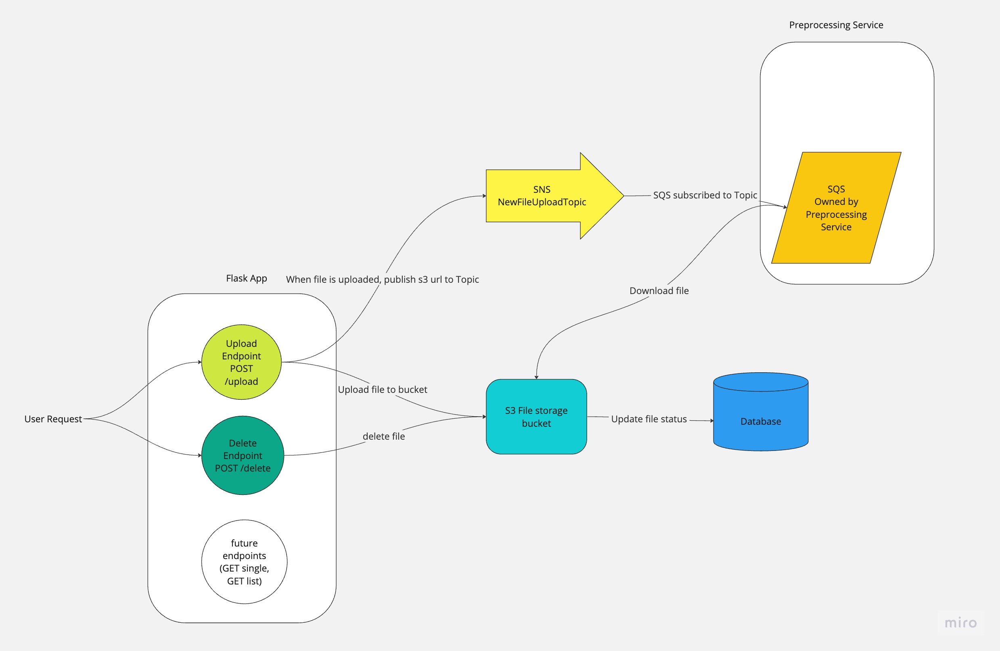

## Deepset Tech Task

### Overview
This Flask API provides an interface for file processing. Users can upload and delete
files via API endpoints. 

### Data Flow
When a new file is uploaded, the file metadata is stored in a SQL database and the status 
is set to "Pending". When it has been uploaded to the AWS S3 bucket successfully, the S3 url
is saved in the database, and the status is changed to "Uploaded". Upon success, a message containing the 
s3 url is published to an SNS topic. The downstream preprocessor would be subscribed
to this topic and have a queue hooked up to it to receive the messages. Once the message has
been received, the preprocessor would use the url to download the file from the s3 bucket.

When a user requests that a file be deleted, the file is deleted from the S3 bucket.
The file can only be deleted if the status is "Uploaded" or "Error", since deleting a file with 
the other statuses might cause issues downstream. In this case no notification is sent.

### Technologies
For this task I have chosen to use Flask, a SQL Database, SQLAlchemy ORM, and boto3 for
accessing S3 for file storage and SNS for notifications.

### API Responses
`POST`: `/upload`

`Body`: file object with valid filename, any data type

`Responses`:

upon success: returns 200 OK with the message "Finished Uploading to s3, Notification Sent"

upon failure: retuns 500 Internal Server Error with the error message.

`POST`: `/delete`

`Body`: file object

`Responses`:

upon success: returns 200 OK

upon failure: returns 500 Internal Server Error with the error message.

upon user error: returns a string message to the user that the status is invalid

### Scaling
The main scaling issue currently would be that the file uploader is synchronous.
For large files, this could cause delays as the system waits for one file at a time to be 
uploaded to s3. 

There are various good options to make the uploader asynchronous. One simple option could be 
to use Celery with a Redis backend. Another 
option could be to use AWS resources in an event-driven architecture. 
In this method you could queue up the files in SQS, and then have either Lamdas or ECS tasks 
uploading them. You would need to send back a notification when the upload is finished
to update the status in the database. 

Regarding the SNS notification: this helps with scaling because we are not sending 
files directly and potentially creating huge payloads. We only send the s3 url, and the
preprocessing system can download it directly. 

### Pros and Cons
Flask is great for quick set up when working in a limited time frame, and it is a small, compact app without a lot of extra 
code and configuration. It also works really well out of the box with both SQLAlchemy and celery.
However, neither of those is known for being lightning fast. 

If the API was going to 
be handling extremely heavy loads, it might make more sense for it to be serverless.
You could use API Gateway and DynamoDB instead of a Flask API with SQL. 

If it was going to be handling light loads, it would not make sense to 
have an API hosted and waiting all the time. One option for this is to host the 
Flask app on AWS lamda. This way, when an endpoint is triggered, you only pay 
for the Lamda runtime.

### Running in Production
This code is definitely not ready to run in production. We would need a database 
set up - for this I would choose Postgres. We would also need an AWS account and to have resources
deployed there, using something like Terraform or CloudFormation. We would
also need to have the environment variables stored in a secure way.

Some other infrastructure that would be good to have before deployment would be
of course tests, logging and error monitoring. Third party tools like Sentry 
and Datadog are invaluable!

### Improvements/To Do
Add a `GET` API endpoint for seeing the status of a particular file.

Add a `GET` API endpoint for seeing a list of files with a certain status.

Add Swagger integration for API documentation, for example the library `Connexion`
is nice for this.

Use a schema library to provide a layer of error handling and data standardization
between the API and the SqlAlchemy ORM.

Question: Does this API need to know what the preprocessing system is doing? If so, we could 
add more statuses indicating when a notification has been delivered and when the 
file is completed. The preprocessing system would then need to send a notification
back to us on completion.

